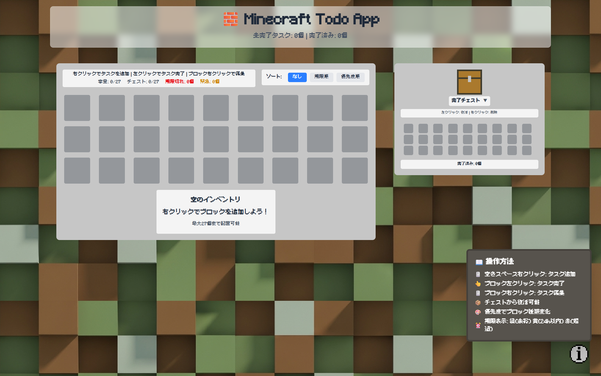
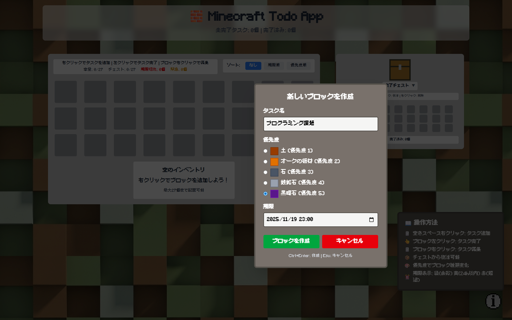
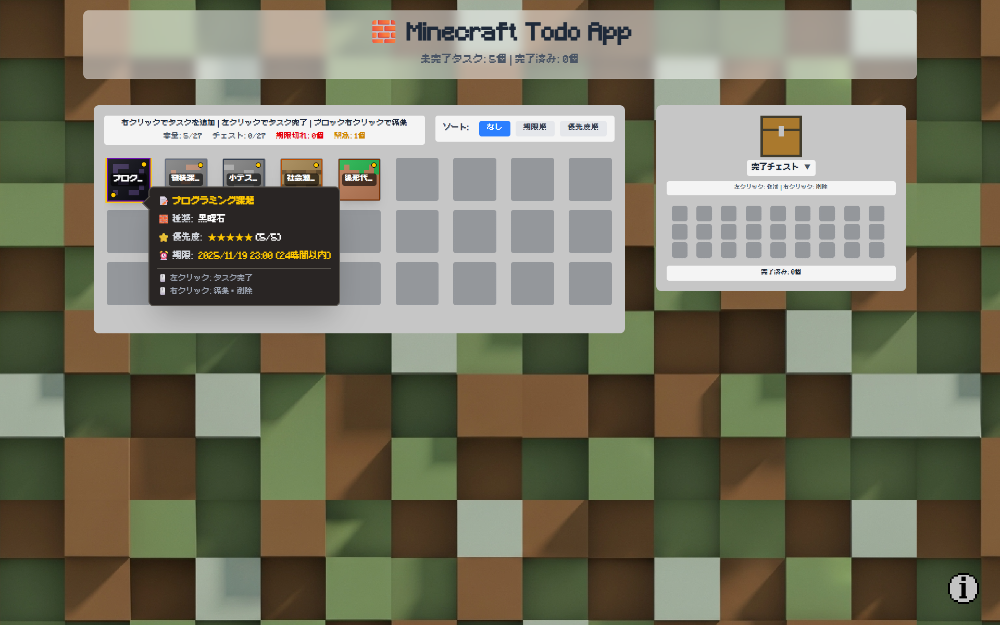
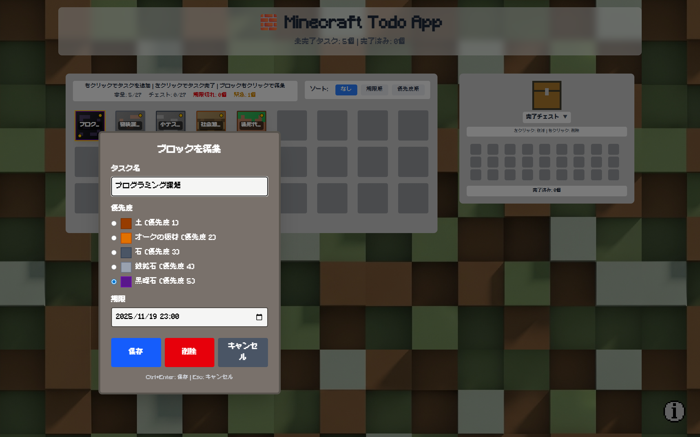
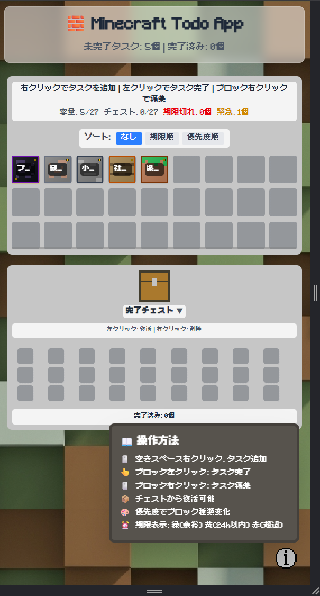

# MC Todo App

## ページの公開URL

https://kai-1208.github.io/mc-todo-app/

## アプリの概要

React、TypeScript、Tailwind CSS を使用し、ローカルストレージでデータを永続化したマインクラフト風Todoアプリです。

### コンセプト

> 「タスクをゲームのように扱うことで、毎日の作業を少しだけでも楽しくする」

通常のTodo管理は味気なく、継続しづらい場面があります。そこで、タスクを「ブロック」として扱い、**掘って破壊したり、チェストに収納するように整理する**という遊び感覚を取り入れ、モチベーションを維持しやすい仕組みにしました。

UIはMinecraft風ですが、**素材・画像・テクスチャはすべて自作または著作権フリー**で構成し、オリジナルデザインとして成立させています。

### 主な機能

#### 基本機能
- タスクの追加・編集・削除  
- ブロックとしてタスクを可視化  
- 優先度に応じてブロックの種類・色が変化
- ローカルストレージでデータを保存

#### オリジナル機能
#### 1. ブロック破壊エフェクト（ひび割れアニメーション）
- ブロック破壊時にひび割れが段階的に進行するアニメーション
- crack_1.png～crack_5.pngを使用した5段階の視覚効果
- 破壊時間はブロックの種類（優先度）に応じて変化

#### 2. パーティクルエフェクト
- ブロック破壊時に破片が飛び散るアニメーション
- ブロックテクスチャを基にした色の破片の生成と消失

#### 3. 完了チェスト機能
- 達成したタスクは「チェスト」に自動収納
- チェスト容量制限（27個）と満杯時の警告機能

### スクリーンショット

- メイン画面


- タスク追加時のメニュー表示


- タスクの情報表示


- タスク編集時のメニュー表示


- ブロック破壊エフェクト（ブロック破壊アニメーション）


- レスポンシブデザイン



## 基本操作

### タスクの追加
1. **インベントリ（グレー背景）内を右クリック**
2. **タスク追加メニューが表示される**
3. **必要な情報を入力**
   - タスク名（必須）
   - 優先度（1～5、数字が大きいほど硬いブロックになる）
   - 期限（オプション）
4. **「追加」ボタンをクリック**

### タスクの完了（ブロック破壊）
1. **ブロックを左クリック**
2. **ひび割れアニメーションが開始**
3. **破壊完了後、自動的に完了チェストに移動**
   - ブロックの種類によって破壊時間が異なる
   - 土ブロック（優先度1）：1秒
   - 石ブロック（優先度2）：2秒
   - 木ブロック（優先度3）：1.5秒
   - 鉄ブロック（優先度4）：3秒
   - 黒曜石（優先度5）：4秒

### タスクの編集・削除
1. **ブロックを右クリック**
2. **編集メニューが表示される**
3. **情報を修正して「保存」または「削除」を選択**

### タスク情報の確認
1. **ブロックにマウスカーソルを合わせる**
2. **ツールチップでタスク詳細が表示される**
   - タスク名
   - 優先度
   - 期限（設定している場合）

### 完了チェストの操作
1. **チェストアイコンをクリックして開く**
2. **完了したタスクの一覧が表示される**
3. **各タスクで以下の操作が可能**
   - **復元**: タスクをインベントリに戻す
   - **削除**: タスクを削除
   - **一括削除**: すべての完了タスクを削除

### ソート機能
- **インベントリのソートボタンで並び替え**
  - **なし**: 追加順
  - **期限順**: 期限が近い順
  - **優先度順**: 優先度が高い順

### 制限事項
- **インベントリ容量**: 最大27個のタスク
- **チェスト容量**: 最大27個の完了タスク
- **満杯時は新しいタスクの追加・完了ができません**

## 工夫した点・挑戦した点

### UIの完全オリジナル化
Minecraft風の雰囲気を保ちつつ、ブロックテクスチャやインフォメーションボタン、ブロック破壊時のひび割れテクスチャはすべて自作、ページの背景はImageFXを使用して作成し、著作権侵害にならないよう配慮した。

### 破壊エフェクトの表現
- ひび割れアニメーションの段階的進行
- requestAnimationFrameを使用したスムーズなエフェクト
- ブロックの硬度に応じた破壊時間の調整

### インタラクティブなUIの実装
- ブロックにカーソルを合わせると、タスク名・優先度・期限・説明などの詳細情報がリアルタイムで表示
- マウスの位置に追従してツールチップが表示され、画面端での自動位置調整機能を実装
- 期限切れ（赤）、緊急（黄）、通常（緑）でブロックの縁色が変化

### レスポンシブ対応の実装
画面サイズに応じてブロックサイズとグリッド間隔を調整し、モバイルからデスクトップまで快適に使用できるよう設計しました。

## 素材・クレジット
このプロジェクトでは、以下のフリー素材やツールを使用しています。制作者の皆様に感謝いたします。

### フォント
- **フォント名:** Minecraft
  - **提供元:** [fontmeme.com](https://fontmeme.com/jfont/minecraft-craftron-gaming-font/)
  - **ライセンス:** 個人利用無料 (Free for Personal Use)

- **フォント名:** 美咲ゴシック第2
  - **提供元:** [littlelimit.net](https://littlelimit.net/misaki.htm)
  - **ライセンス:** 個人・商用利用ともに無料 (クレジット表記不要)

### 画像・アイコン
- **アイコン:** 自作
- **ブロックテクスチャ:** 自作
- **背景画像:** Google LabsのAI画像生成ツール「[ImageFX](https://labs.google/fx/ja/tools/image-fx)」を使用して生成。

## 技術スタック
| 分類 | 使用技術 |
|------|-----------|
| フレームワーク | React (Vite) |
| 言語 | TypeScript |
| 状態管理 | useState / useEffect |
| スタイリング | Tailwind CSS |
| データ永続化 | LocalStorage |
| ライブラリ | uuid |
| 開発環境 | ESLint, TypeScript |
| デプロイ | GitHub Pages |

## セットアップ方法

```bash
npm install
npm run dev
```

## ライセンス

MIT License

Copyright (c) 2025 otetehandcreampan

Permission is hereby granted, free of charge, to any person obtaining a copy
of this software and associated documentation files (the "Software"), to deal
in the Software without restriction, including without limitation the rights
to use, copy, modify, merge, publish, distribute, sublicense, and/or sell
copies of the Software, and to permit persons to whom the Software is
furnished to do so, subject to the following conditions:

The above copyright notice and this permission notice shall be included in all
copies or substantial portions of the Software.

THE SOFTWARE IS PROVIDED "AS IS", WITHOUT WARRANTY OF ANY KIND, EXPRESS OR
IMPLIED, INCLUDING BUT NOT LIMITED TO THE WARRANTIES OF MERCHANTABILITY,
FITNESS FOR A PARTICULAR PURPOSE AND NONINFRINGEMENT. IN NO EVENT SHALL THE
AUTHORS OR COPYRIGHT HOLDERS BE LIABLE FOR ANY CLAIM, DAMAGES OR OTHER
LIABILITY, WHETHER IN AN ACTION OF CONTRACT, TORT OR OTHERWISE, ARISING FROM,
OUT OF OR IN CONNECTION WITH THE SOFTWARE OR THE USE OR OTHER DEALINGS IN THE
SOFTWARE.

## 開発期間

開発期間: 2025.10.23 ~ 2025.11.19 (約25時間)